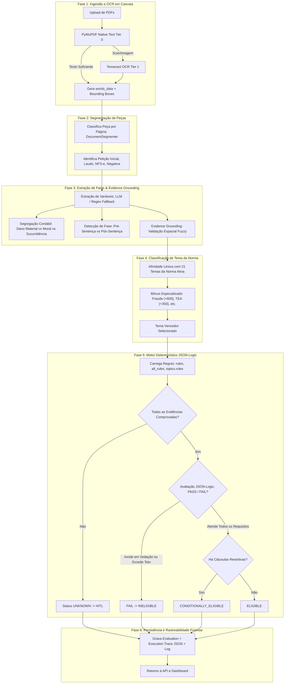

# 🔄 REVERSA — Fluxograma do Módulo de Análise de Processos

```mermaid
flowchart TD
    subgraph S1["Fase 1: Ingestão e OCR em Cascata"]
        A["Upload de PDFs"] --> B["PyMuPDF Native Text Tier 0"]
        B -->|Texto Suficiente| D["Gera words_data + Bounding Boxes"]
        B -->|Scan/Imagem| C["Tesseract OCR Tier 1"]
        C --> D
    end

    subgraph S2["Fase 2: Segmentação de Peças"]
        D --> E["Classifica Peça por Página: DocumentSegmenter"]
        E --> F["Identifica Petição Inicial, Laudo, NFS-e, Negativa"]
    end

    subgraph S3["Fase 3: Extração de Fatos & Evidence Grounding"]
        F --> G["Extração de Variáveis: LLM / Regex Fallback"]
        G --> H["Segregação Contábil: Dano Material vs Moral vs Sucumbência"]
        G --> I["Detecção de Fase: Pré-Sentença vs Pós-Sentença"]
        G --> J["Evidence Grounding: Validação Espacial Fuzzy"]
    end

    subgraph S4["Fase 4: Classificação de Tema da Norma"]
        J --> K["Afinidade Léxica com 21 Temas da Norma Ativa"]
        K --> L["Bônus Especializado: Fraude (+600), TEA (+350), etc."]
        L --> M["Tema Vencedor Selecionado"]
    end

    subgraph S5["Fase 5: Motor Determinístico JSON-Logic"]
        M --> N["Carrega Regras: rules, all_rules, topics.rules"]
        N --> O{"Todas as Evidências Comprovadas?"}
        O -->|Não| P["Status UNKNOWN -> HITL"]
        O -->|Sim| Q{"Avaliação JSON-Logic: PASS / FAIL?"}
        Q -->|Incide em Vedação ou Excede Teto| R["FAIL -> INELIGIBLE"]
        Q -->|Atende Todos os Requisitos| S{"Há Cláusulas Restritivas?"}
        S -->|Sim| T["CONDITIONALLY_ELIGIBLE"]
        S -->|Não| U["ELIGIBLE"]
    end

    subgraph S6["Fase 6: Persistência e Rastreabilidade Forense"]
        P --> V["Grava Evaluation + Execution Trace JSON + Log"]
        R --> V
        T --> V
        U --> V
        V --> W["Retorno à API e Dashboard"]
    end
```
