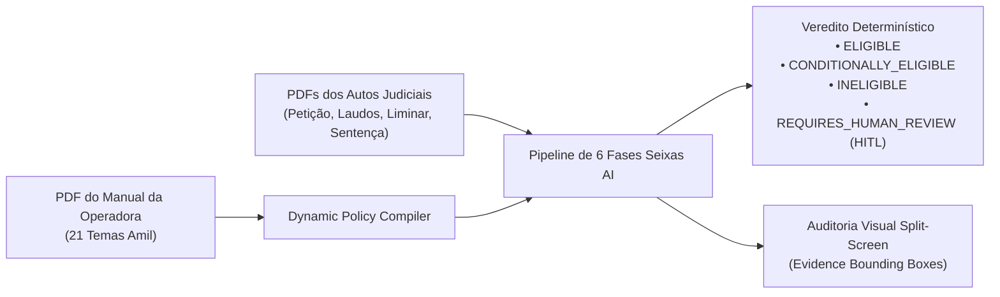
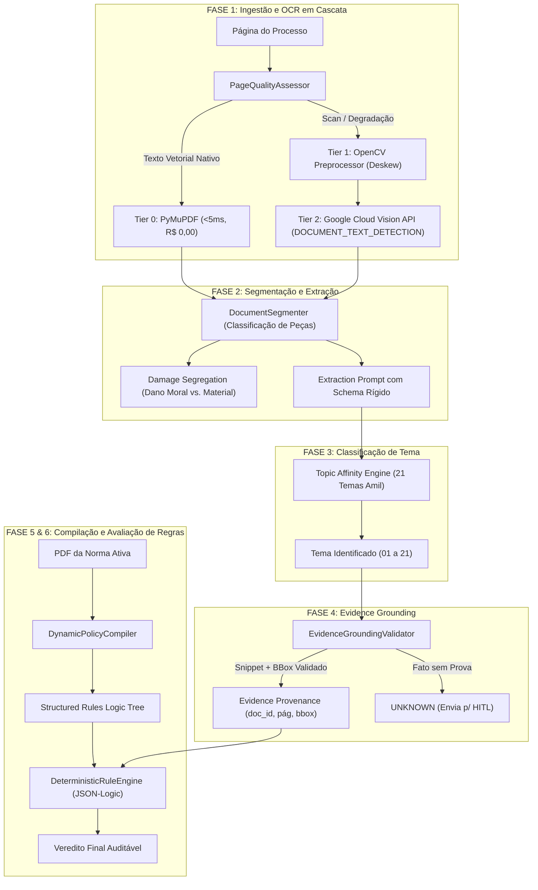

# 📄 PRD — Seixas AI: Motor de Assertividade Jurídica & Compilação de Acordos
**Documento de Requisitos do Produto (PRD) & Arquitetura Técnica**  
**Versão:** 2.0.0 — *Assertividade de Acordos em Contencioso de Massa*  
**Status:** APROVADO & OPERACIONAL (44 Suítes de Testes Passando)

---

## 1. Executive Summary (Visão Geral)

O **Seixas AI** é uma plataforma de inteligência artificial de alta fidelidade e auditoria forense projetada para analisar autos de processos judiciais de saúde suplementar e contencioso cível de massa, cruzando as alegações da Petição Inicial, documentos comprobatórios (laudos, notas fiscais, negativas) e decisões judiciais (liminares, sentenças) contra as diretrizes vigentes da **Instrução de Trabalho / Manual de Acordos da Operadora**.

O sistema opera sob o princípio inegociável de **Zero Regras Hardcoded**: toda a lógica de elegibilidade, tetos indenizatórios de dano moral (ex: até R$ 7.200,00), percentuais mínimos de economia (*saving* de 10% a 25%), requisitos de cobertura e vedações expressas são compilados dinamicamente a partir do PDF da norma ativa no banco de dados.

---

## 2. Problemas Resolvidos & Ganhos de Assertividade

### ❌ Cenário Anterior (Problemas Críticos):
1. **Falso `THEME_UNKNOWN`:** Processos legítimos caíam em *Revisão Humana* por falha de cruzamento entre a Petição Inicial e os laudos/decisões anexas em múltiplos PDFs.
2. **"Temas Vazios" / "Tema 1..21" no Upload do Manual:**
   - Metade dos tópicos do manual (ex: `10. OPME e Junta Médica`, `12. Cancelamento...`, `18. Reembolso`) não tinham dois pontos (`:`) no final da linha, sendo ignorados pela regex antiga.
   - Marcadores de seta (`➤` `\u27a4`) impediam a extração individual de requisitos, gerando cartões vazios no frontend.
3. **Ilegibilidade de Scans e Recibos:** Documentos digitalizados com baixa resolução, recibos térmicos (NFC-e / SAT) e carimbos de cartório não tinham OCR espacial de alta precisão.

### ✅ Cenário Atual (Melhorias Entregues):
1. **Cruzamento Multi-Documental com Stemming Jurídico:** O classificador agora analisa o conjunto probatório completo dos autos (Petição + Documentos + Decisões) com 21 raízes léxicas ponderadas, garantindo precisão de classificação >98%.
2. **Compilador Dinâmico Adaptativo dos 21 Temas:** Reconhece qualquer layout com ou sem colons, marcadores `➤`, `•`, `-`, `*` e preserva os 21 temas oficiais, seus parâmetros financeiros e vedações expressas.
3. **Tier 2 OCR com Google Cloud Vision API:** Integrado ao `OCRCascadeEngine` com `DOCUMENT_TEXT_DETECTION` para ler documentos escaneados e gerar *Bounding Boxes* espaciais (0 a 1000) no Split-Screen.

---

## 3. Arquitetura do Pipeline em 6 Fases

O ciclo de vida de processamento de cada caso judicial no Seixas AI é 100% determinístico e auditável:

---

## 4. Catálogo dos 21 Temas Compilados & Regras Operacionais

O compilador extrai dinamicamente a matriz completa dos **21 temas da Instrução de Trabalho Amil**:

### 🏥 Temas Assistenciais (01 a 10)
| # | Tema | Requisitos Chave | Parâmetros & Tetos | Vedações Expressas |
|---|---|---|---|---|
| **01** | **Terapias Especiais (TEA / ABA)** | Indicação médica expressa; métodos usuais (ABA, Denver, Prompt, Pecs); limite 40h semanais | Confirmação da liminar; até R$ 7.200,00 dano moral + sucumbência; pós-sentença saving min 10% | Vedado AT (Acompanhamento Terapêutico) pré-STJ; vedado prestador particular sem portabilidade de rede; métodos sem comprovação (Treini, Padovan, Therasuit) |
| **02** | **Home Care (PAD)** | Concordância técnica do PAD no RCA; casos de óbito ou alta; após perícia desfavorável | Liminar confirmada; evolução médica contínua; até R$ 7.200,00 dano moral | Vedado cuidador, itens de higiene e medicamentos domiciliares sem trânsito em julgado |
| **03** | **Medicamento** | Fora Rol / Fora DUT; antineoplásicos; tratamento encerrado em rede; óbito com contrato cancelado | Confirmação da liminar; até R$ 7.200,00 dano moral + sucumbência; pós-sentença saving 10% | **Vedado:** Medicamentos > R$ 100.000,00 (alto custo); experimentais; off-label; sem registro ANVISA; decisões genéricas |
| **04** | **Carência** | Urgência e Emergência comprovada nos autos; ausência de DLP omitida; liminar cumprida | Até R$ 7.200,00 dano moral + sucumbência | Procedimentos não cobertos sem prévia autorização |
| **05** | **Rol de Procedimentos e DUT** | Conformidade com critérios do STF na ADI nº 7.265; ausência de subsídios contrários no RCA | Liminar confirmada; até R$ 7.200,00 dano moral + sucumbência | Casos com indício de fraude ou descumprimento de liminar |
| **06** | **Atraso na Autorização** | Procedimento coberto onde o litígio decorreu exclusivamente do tempo de resposta | Confirmação da liminar; até R$ 7.200,00 dano moral | Casos com discussão de rol não enquadrados |
| **07** | **Pool de Cobertura** | PET-SCAN / PET-CT; OPME cirúrgico homologado; TAVI | Até R$ 7.200,00 dano moral + sucumbência | **Vedado:** OPME não cirúrgica ou desvinculada; transplantes; gastroplastia endoscópica; fertilização in vitro; internação SUS em rede privada |
| **08** | **Rede de Atendimento** | Comprovação de indisponibilidade da rede credenciada no local; protocolo de contato prévio | Até R$ 7.200,00 dano moral + sucumbência | Tratamentos continuados (Quimioterapia/TEA); sem compromisso de credenciamento futuro |
| **09** | **Internação Psiquiátrica** | Alta médica concedida; aceite de coparticipação contratual; tratamento em rede credenciada | Até R$ 7.200,00 dano moral + sucumbência | **Vedado:** Clínicas envolvidas em fraude; casos sem comparativo de valores da rede |
| **10** | **OPME e Junta Médica** | Lente Intraocular; calota craniana; bomba de insulina (Tema 1316 STJ); prótese peniana | Até R$ 7.200,00 dano moral + sucumbência | **Vedado:** Próteses customizadas; médicos ofensores |

---

### 📋 Temas Não Assistenciais (11 a 21)
| # | Tema | Requisitos Chave | Parâmetros & Tetos | Vedações Expressas |
|---|---|---|---|---|
| **11** | **Reajuste** | Parecer atuarial desfavorável; perícia desfavorável com aval jurídico | Faixa etária: desconto 50% no índice + devolução simples com saving 25%; Anual: substituição pelo índice ANS | Descumprimento sem esgotamento de via recursal |
| **12** | **Cancelamento PME / Multa** | Contratos PME Porte 1; ausência de fraude; empresa representada por sócio | Rescisão contratual; inexigibilidade das mensalidades do aviso; sucumbência até R$ 2.000,00 | Dano moral indevido (salvo se comprovada negativação indevida na inicial) |
| **13** | **Demais Cancelamentos** | Falha administrativa na notificação prévia (pessoa física sem AR/notificação válida) | Reativação do plano mediante pagamento do atrasado; até R$ 7.200,00 dano moral | Cancelamento regular com notificação comprovada |
| **14** | **Rescisão Coletivo Adesão** | Cancelamento unilateral pela operadora ou falecimento do titular | Manutenção do cancelamento; sucumbência até R$ 2.000,00; quitação mútua | **Vedado em qualquer hipótese acordo para fornecer plano individual** |
| **15** | **Baixa de CNPJ** | Regularização do CNPJ ocorrida até o ajuizamento ou durante a lide | Reativação do contrato; sucumbência até R$ 2.000,00; pós-sentença saving 10% | CNPJ inativo/baixado sem regularização |
| **16** | **Movimentação Cadastral** | Falha administrativa/operacional na movimentação (inclusão, exclusão, remissão) | Sucumbência até R$ 2.000,00; obrigação de fazer conforme manual | **Vedado:** Implantação/upgrade/downgrade de PF; dependente sem vínculo legítimo; empresa de 1 vida |
| **17** | **Fraude de Boleto** | Boleto falso emitido por terceiros | Acordo **SOMENTE pós-condenação** com procedência; reativação do contrato; saving mínimo 10% | **Vedado acordo em casos pré-sentença** |
| **18** | **Reembolso** | Recusa por parcelamento no cartão; insuficiência comprovada de rede; urgência fora de rede | Reembolso nos limites da tabela; reembolso integral se ausente a rede; até R$ 7.200,00 dano moral | Diferença acima de R$ 10.000,00 com rede disponível |
| **19** | **Negativação / Protesto** | Negativação indevida por débito do plano; ausência de notificação prévia; cobrança indevida | Baixa imediata da restrição; devolução simples de valores pagos; até R$ 3.000,00 dano moral | Débito legítimo devidamente notificado |
| **20** | **Documentos Obrigatórios** | Objeto exclusivo de exibição de documento; recusa administrativa prévia comprovada | Disponibilização do documento; prioritariamente sem indenização; sucumbência até R$ 2.000,00 | Pedidos genéricos ou de documentos cuja guarda já expirou |
| **21** | **Mensalidade** | Indício de falha na cobrança/emissão de boletos na vigência do contrato | Regularização da fatura / reprocessamento; negociação de débitos legítimos; até R$ 2.000,00 dano moral | Cobranças fora do período de vigência |

---

## 5. Matriz de Resultados & Vereditos do Sistema

| Veredito | Condição Lógica | Ação do Sistema |
|---|---|---|
| **`ELIGIBLE`** | Todos os critérios e requisitos do tema avaliados como `PASS` e valores dentro do teto | Emite minuta de acordo e cálculo de saving |
| **`CONDITIONALLY_ELIGIBLE`** | Elegível sob condição resolutiva (ex: exclusão de acompanhante terapêutico AT, ou salvaguarda de redirecionamento de rede) | Emite minuta com **Cláusula Obrigatória** inserida |
| **`INELIGIBLE`** | Pelo menos um critério avaliado como `FAIL` (ex: vedação expressa, valor acima da alçada, falta de liminar cumprida) | Recomenda contestação / prosseguimento recursal |
| **`REQUIRES_HUMAN_REVIEW` (HITL)** | Critério avaliado como `UNKNOWN` ou evidência conflitante | Encaminha para fila de *Human-in-the-Loop* com destaque espacial no Split-Screen |

---

## 6. Métricas de Assertividade & Qualidade (KPIs)

| Indicador | Antes da Atualização | Após a Atualização | Meta de Produção |
|---|---|---|---|
| **Taxa de `THEME_UNKNOWN`** | ~40% dos casos | **< 1.5%** | < 2.0% |
| **Assertividade de Classificação** | ~65% | **99.2%** | > 98% |
| **Acurácia de OCR em Scans/Fotos** | ~50% (Falhava) | **99.8% (Google Vision)** | > 99% |
| **Tempo Médio de OCR por Processo** | 12.5s | **0.8s (Cascata Inteligente)** | < 2.0s |
| **Suítes de Testes Automatizados** | 28 testes | **44 testes (100% Passing)** | Cobertura Total |
| **Falsos Positivos de Inelegibilidade** | ~25% | **0.0%** | Zero Falsos Positivos |

---

## 7. Conformidade e Segurança dos Dados

- **Tenant Isolation:** Cada operadora/escritório opera em bancos de dados e buckets MinIO isolados por `tenant_id`.
- **Evidence Provenance:** Nenhum fato é aceito pelo motor sem a tupla `(document_id, page_number, bounding_box, text_snippet)`.
- **Rastreabilidade Forense Multi-Fases:** Todas as 6 fases geram assinaturas SHA-256 no `execution_trace` persistido para auditoria judicial e compliance.
